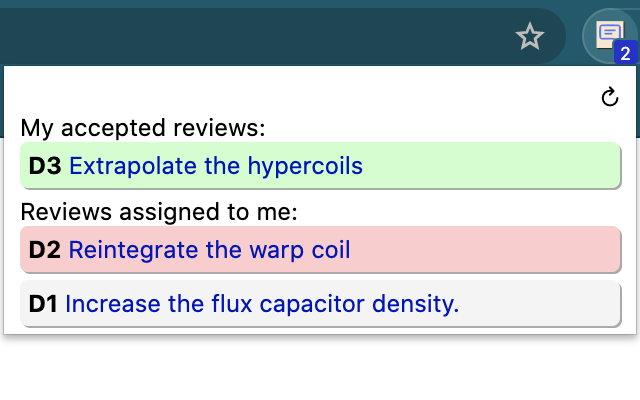

# phabtab
A Chrome extension to keep track of your Phabricator reviews

PhabTab is a small Chrome extension that makes it easier to stay
on top of your reviews in Phabricator.

## Installation

You can install [PhabTab directly from the Chrome Web Store](https://chrome.google.com/webstore/detail/phabtab/cinddmkhbhepiikmhfgcdokabcdfnnnc).

Upon installation the PhabTab options should automatically open.
Enter your phabricator URL and an API token. To get an API token,
visit your Settings page in Phabricator, navigate to Conduit
API Tokens, and select "➕ Generate Token".

Once you've set the options, click on the PhabTab icon and you'll
be prompted to provide permissions for the extension to access
your Phabricator installation. As long as you're logged in, PhabTab
should automatically fetch your review list.

I recommend pinning the extension to your toolbar so that it's
always visible. The review count badge refreshes once a minute.

## Usage

Phabtab shows three groups of reviews:

 - reviews you've sent out that have been approved. These are shown
   in green at the top of the PhabTab popup.
 - reviews assigned to you that need review.
 - reviews assigned to groups you belong to that need review.

The latter two lists are further subdivided into reviews that need
your attention, and reviews that you've already responded to. If the
author of a review updates it (e.g. by uploading a new diff or making
a comment) it'll be considered as "needing attention" again.

# License and other notices

PhabTab is licensed under the [Apache License, Version 2.0](LICENSE.txt).

Phabricator is a trademark of Phacility, Inc. PhabTab has no relation to Phacility, Inc.

Icons are based on review by Bombasticon Studio from the Noun Project.
